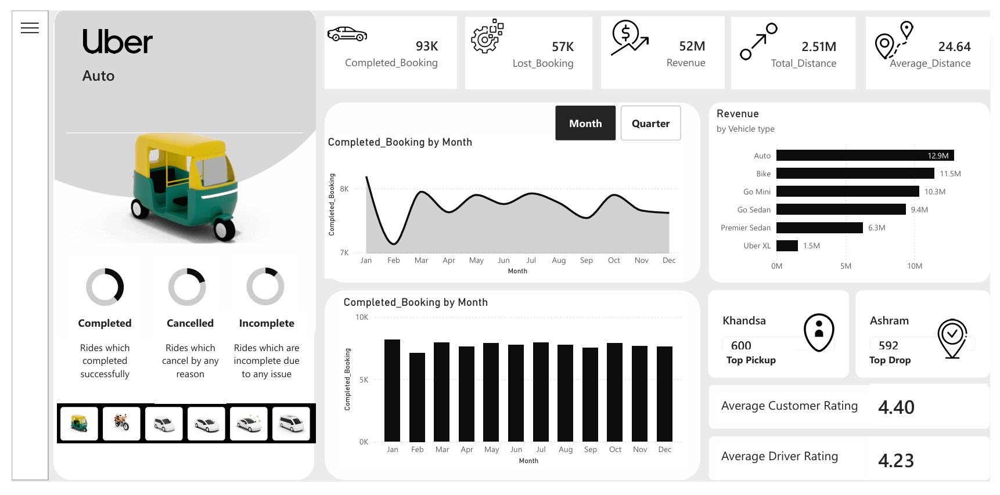

## Uber Ride Analytics Dashboard

## Overview

This project presents an interactive Uber Ride Analytics Dashboard built to analyze ride data and generate actionable business insights. The dashboard helps in understanding booking trends, revenue distribution, customer behavior, and operational performance.

It is designed to support data-driven decision-making by visualizing key performance indicators and patterns across different dimensions such as time, location, and vehicle type.

## Dashboard Preview

## Key Metrics
Completed Bookings: 93K
Lost Bookings: 57K
Total Revenue: 52M
Total Distance: 2.51M
Average Distance: 24.64

## Features
# Performance Analysis

The dashboard highlights total completed bookings and lost bookings, allowing identification of inefficiencies in the booking system.

# Time-Based Trends

Monthly analysis of completed bookings helps in understanding seasonal demand patterns and peak usage periods.

# Revenue Analysis

Revenue is segmented by vehicle type such as Auto, Bike, Go Mini, Go Sedan, Premier Sedan, and Uber XL. This helps identify the most profitable services.

# Booking Status Breakdown

The dashboard differentiates between completed, cancelled, and incomplete rides, providing insight into operational challenges.

# Location Insights

Top pickup and drop locations are identified to understand high-demand areas and improve service availability.

# Ratings Analysis

Customer and driver ratings are displayed to evaluate service quality and identify improvement areas.

# Tools and Technologies
Power BI
Data Visualization Techniques
Data Cleaning and Transformation
CSV Dataset

# Business Insights
A high number of lost bookings indicates potential issues in ride availability or cancellations.
Revenue contribution varies significantly across vehicle types, with some categories driving the majority of income.
Monthly trends reveal fluctuations in demand, which can be used for pricing and supply optimization.
Slight differences between customer and driver ratings suggest areas for service improvement.

#Use Cases

Monitoring business performance
Identifying operational inefficiencies
Understanding customer behavior
Supporting strategic decision-making

# Future Improvements

Integration with real-time data sources
Predictive analytics for demand forecasting
City-wise or region-wise comparative analysis
Integration with SQL or cloud databases
